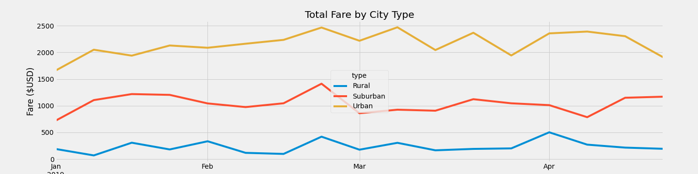

# PyBer Analysis

## Overview

***Background***

As a new employee as a data analyst at Pyber, a Python-based ridesharing app company, we first did an exploratory analysis on two large CSV files. We created different graphs (line, bar, scatter, bubble) using the Matplotlib library in Jupyter Notebook. We were able to create analysis to help Pyber improve ridesharing access to underserved neighborhoods. We specifically look at the data from the three different city types: Urban, Suburban, and Rural. 

***Purpose***

After the exploratory analysis of Pyber's data, the purpose of our new assignment is to create a summary DataFrame of ridesharing by data type. Then, we were tasked with using Pandas and Matplotlib to create a multiple line graph that demonstrates the weekly fares for each city type (Urban, Suburban, and Rural). From the data summary, graphs, and visualizations, we will report our findings to PyBer. 

## Resources 
- Data Source: city_data.csv, ride_data_csv
- Software: Python 3.9.12, Anaconda 4.14.0, Jupyter Notebook 6.4.8 , Pandas, Matplotlib

## Results: Statistics & Analysis

### Summary Statistics 

### Visualization Analysis

## Summary

