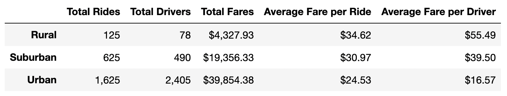

# PyBer Analysis

## Overview

***Background***

As a new employee as a data analyst at Pyber, a Python-based ridesharing app company, we first did an exploratory analysis on two large CSV files. We created different graphs (line, bar, scatter, bubble) using the Matplotlib library in Jupyter Notebook. We were able to create analysis to help Pyber improve ridesharing access to underserved neighborhoods. We specifically look at the data from the three different city types: Urban, Suburban, and Rural. 

***Purpose***

After the exploratory analysis of Pyber's data, the purpose of our new assignment is to create a summary DataFrame of ridesharing by data type. Then, we were tasked with using Pandas and Matplotlib to create a multiple line graph that demonstrates the weekly fares for each city type (Urban, Suburban, and Rural). From the data summary, graphs, and visualizations, we will report our findings to PyBer. 

## Resources 
- Data Source: city_data.csv, ride_data_csv
- Software: Python 3.9.12, Anaconda 4.14.0, Jupyter Notebook 6.4.8 , Pandas, Matplotlib

## Results: Statistics & Analysis

### Summary Statistics 
Before creating a summary table, two csv files (ride_data.csv and city_data.csv) had to be read, converted into DataFrames, and merged. Then the groupby() and count()/ sum() functions were used to find the necessary information. To find Average Fare per Ride, we divided the number of rides by total fares. Lastly, to find the Average Fare per Driver, we divided the Total Drivers by Total Fares for each city type. See the Pyber summary DataFrame organized by type of city (Rural, Suburban, and Urban) below:  

From this table, we can assume: 
1. 
2. 
3. 

### Visualization Analysis
After creating a summary table, we then continued our analysis by creating a multiple-line graph that shows the total fares for each week by city type. To do this, we grouped our merged data frame by "type," "date," and the sum of the "fare." To use the date column, we had to reset the index to first create a pivot table of our grouped information. Then we used the loc() function to find the fares from '2019-01-01':'2019-04-28' (January 2019 to April 2019). Next, we had to change the index type to datetime so our last resample() function would work. We used the resample() function to find the sum of the fares per week. 

From this graph, we can assume: 
1.
2.
3.

## Summary
1. 
2. 
3. 

